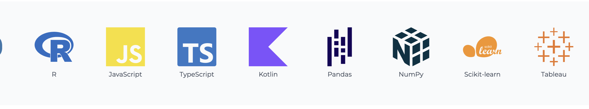
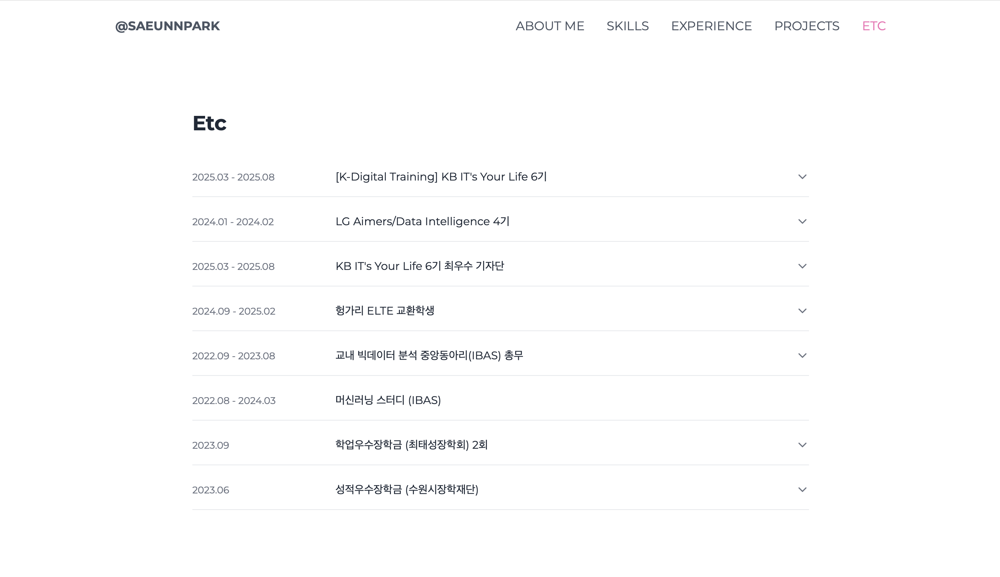
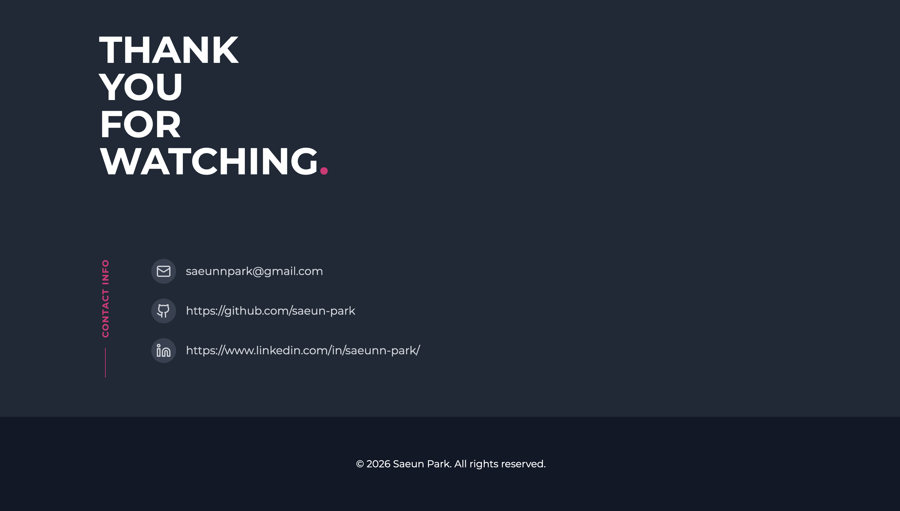

# Portfolio

🤧 미완성입니다

Vite + React + TypeScript 기반으로 제작한 개인 포트폴리오 웹사이트입니다.

---







---

## Deployment Flow (GitHub Pages)

이 포트폴리오는 GitHub Pages를 통해 배포됩니다.

### 배포 절차

```bash
# 1. 변경사항 커밋 & 푸시
git push origin main

# 2. 배포
npm run deploy
```
