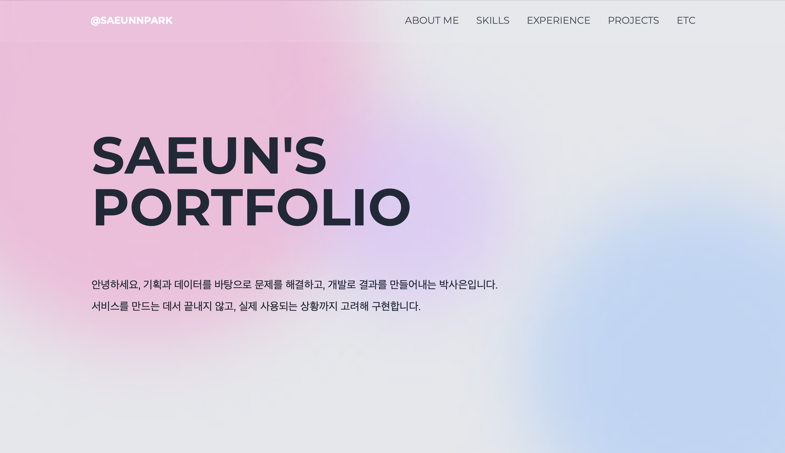
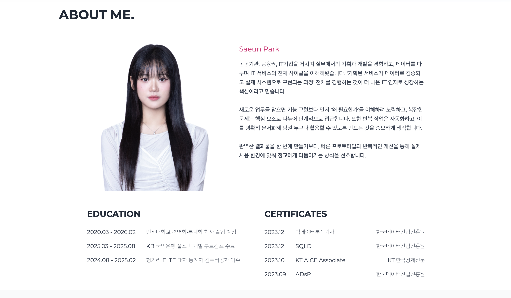
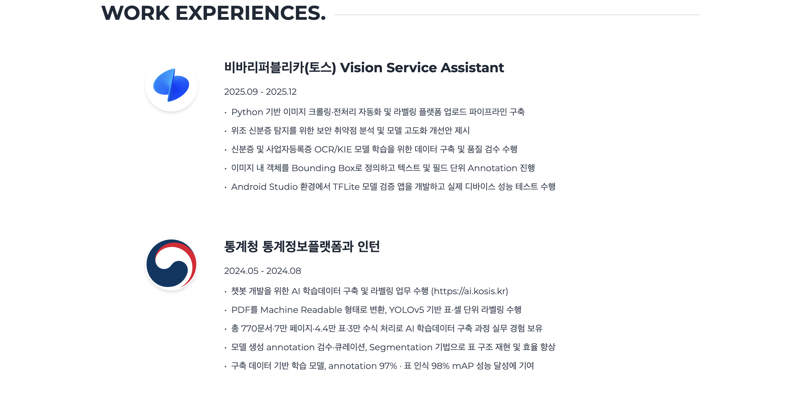

# Portfolio

Vite + React + TypeScript 기반으로 제작한 개인 포트폴리오 웹사이트입니다.

🔗 Live Demo  
https://saeun-park.github.io

---






<!-- ## Portfolio Structure

### 1. Main Page

- 첫 랜딩 화면
- 소개 한 줄 요약

### 2. About Me

- 간단한 자기소개
- 프로필 사진
- 교육 및 자격증

### 3. Skills

- 기술 스택 정리
- 사용 경험이 있는 라이브러리 / 도구 소개
- 마퀴 형식으로 구성

### 4. Work Experiences

- 일 경험

### 5. Projects

- 개인 / 팀 프로젝트 정리
- 각 프로젝트별:
  - 프로젝트 개요
  - 담당 역할
  - 사용 기술
  - 구현 기능 요약
  - 배운 점 / 문제 해결 경험

### 6. Etc

- 이외의 활동들 요약

### 7. Contact

- 아직 X (추가 예정) -->

<!-- ---

## Tech Stack

- **Vite**
- **React**
- **TypeScript**
- **Tailwind CSS** -->

---

## Deployment Flow (GitHub Pages)

이 포트폴리오는 GitHub Pages를 통해 배포됩니다.

### 배포 절차

```bash
# 1. 변경사항 커밋 & 푸시
git push origin main

# 2. 배포
npm run deploy
```
